# A.E.G.I.S autocraft for CC:Tweaked

A.E.G.I.S. is a CC:Tweaked autocraft in plain Lua. The first version was really basic — no dependency tree, no scheduler, just pulling ready components from a chest for one-level crafts. But I got so hooked on the process itself that after half a year of endless tweaking and feature creep the project grew way bigger than I'd originally planned — kind of a *factory core in a single computer*. 12k lines in and I'm still poking at it. Ah right — the factory must grow.

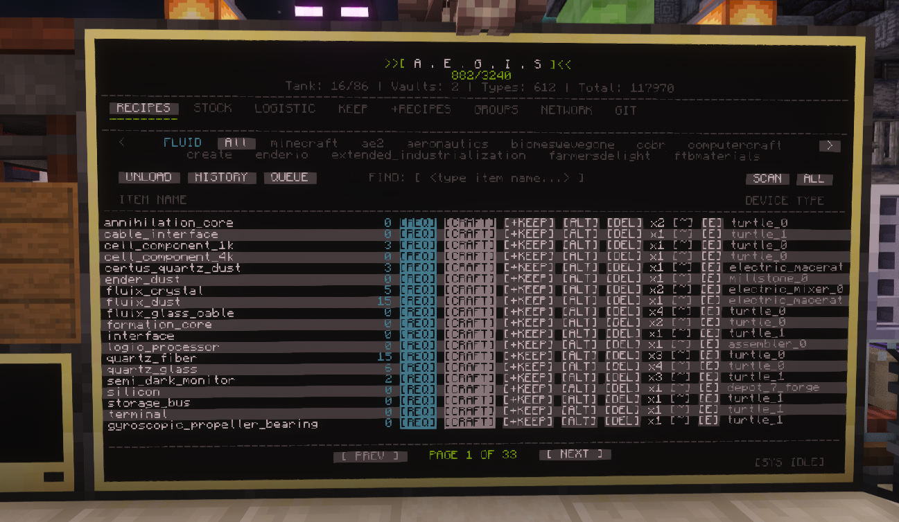

When you request an item, A.E.G.I.S. keeps the taught recipes on disk, walks the dependency tree, checks what's already sitting in your vaults, and sends the missing ingredients to whichever free machines it knows about.

Teaching is interactive: drop the ingredients into T.BOX (3x3 for turtle crafts, or just place them for a machine recipe), pick the machine, hit SCAN. That's it — recipe is saved. Next time you order that item, the system walks the dependencies itself and crafts everything up to the final product. More details in the [Teaching recipes](#teaching-recipes-recipes-tab) section.

How well a specific machine works comes down to what the mod exposes to the CC:Tweaked peripheral API — the system only ever sees what the peripheral tells it. See [Known limitations](#known-limitations).

---

## Requirements

- **Advanced Computer** — must be placed directly to the left of the monitor wall.
- **Advanced Monitors** — 5x3 or larger is comfortable, other layouts work too.
- **Crafty Turtle** — Advanced Turtle running `turtle/startup.lua`, used for 3x3 grid recipes.
- **Storage** — connected chests, vaults, drawers or tanks.
- **T.BOX** — one barrel or chest used as staging area for teaching recipes and item delivery.
- **Wired network** — modems on every machine/chest, connected by cable, activated (red ring on).

---

## Quick setup

<table border="0" cellspacing="0" cellpadding="8" style="border-collapse:collapse;border:0;background:transparent;">
<tr style="background:transparent;">
<td valign="top" width="42%" style="border:0;background:transparent;">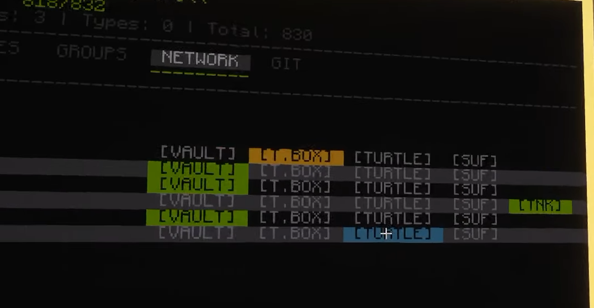</td>
<td valign="top" style="border:0;background:transparent;"><b>Install & tag</b>  Drop <code>computer/startup.lua</code> onto the Advanced Computer, <code>turtle/startup.lua</code> onto the turtle, then <code>reboot</code>. On the monitor, open the <b>NETWORK</b> tab and tag your peripherals: storages → <code>[VAULT]</code>, staging barrel → <code>[T.BOX]</code>, crafting turtles → <code>[TURTLE]</code>, fluid tanks → <code>[TNK]</code> (optional).</td>
</tr>
</table>

---

## Teaching recipes (+RECIPES tab)

<table border="0" cellspacing="0" cellpadding="8" style="border-collapse:collapse;border:0;background:transparent;">
<tr style="background:transparent;">
<td valign="top" width="42%" style="border:0;background:transparent;">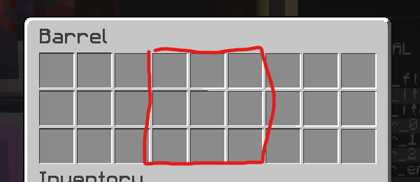</td>
<td valign="top" style="border:0;background:transparent;"><b>3x3 grid recipe</b>  Lay ingredients in the 3x3 center of T.BOX, then <code>+RECIPES → TURTLE → SCAN</code>.</td>
</tr>
<tr style="background:transparent;">
<td valign="top" width="42%" style="border:0;background:transparent;">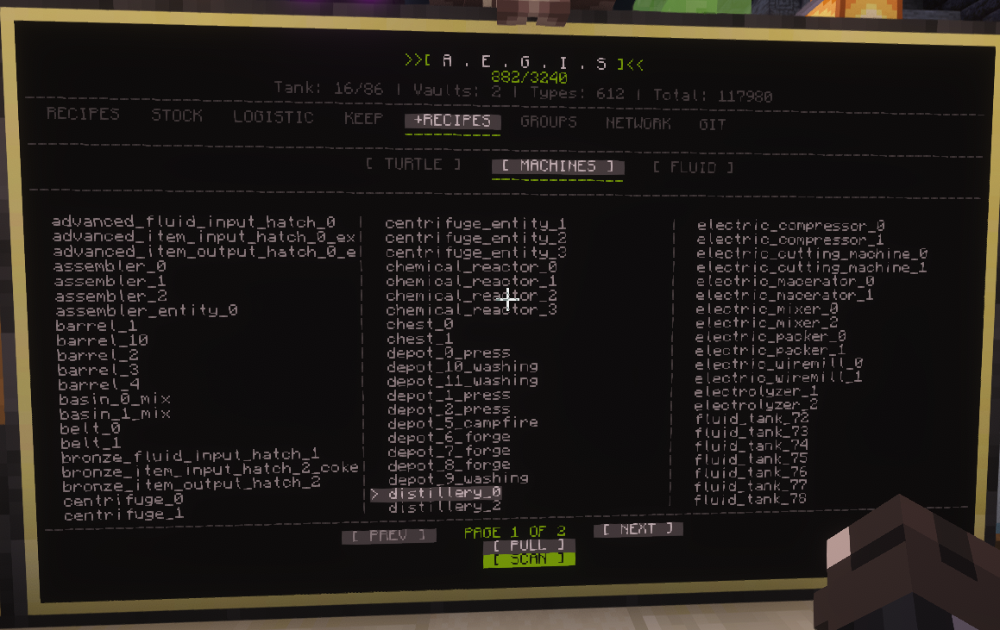</td>
<td valign="top" style="border:0;background:transparent;"><b>Machine recipe</b>  Place ingredients in T.BOX, select the machine on the computer, then <code>+RECIPES → MACHINES → SCAN</code>.</td>
</tr>
<tr style="background:transparent;">
<td valign="top" width="42%" style="border:0;background:transparent;">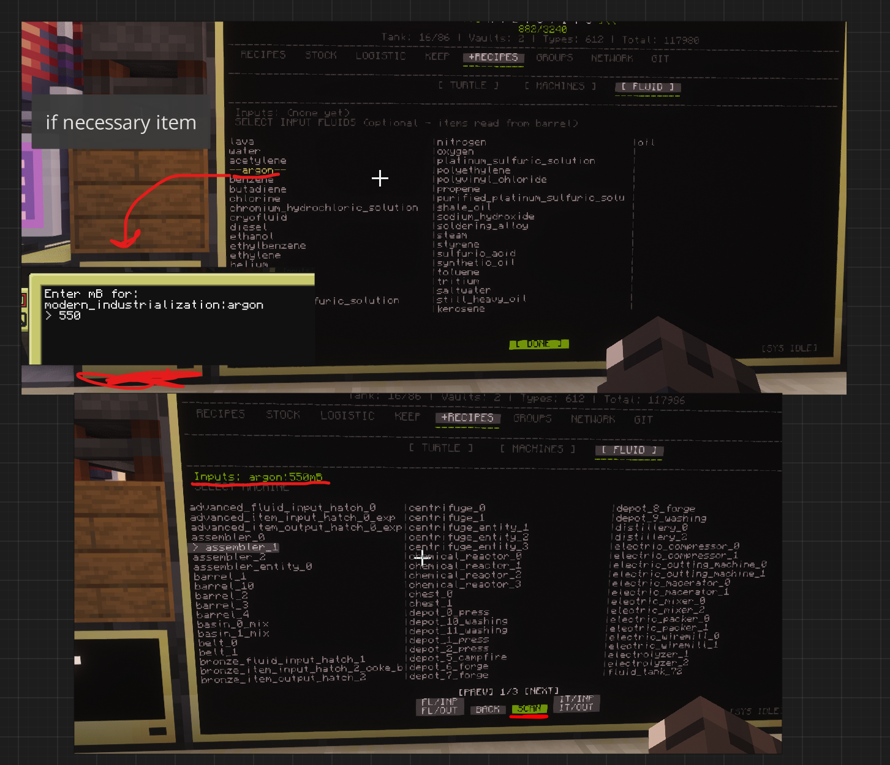</td>
<td valign="top" style="border:0;background:transparent;"><b>Fluid / hybrid recipe</b>  Solid items go into T.BOX, fluid type and mB volume are typed on the computer, then <code>+RECIPES → FLUID → SCAN</code>.</td>
</tr>
<tr style="background:transparent;">
<td valign="top" width="42%" style="border:0;background:transparent;">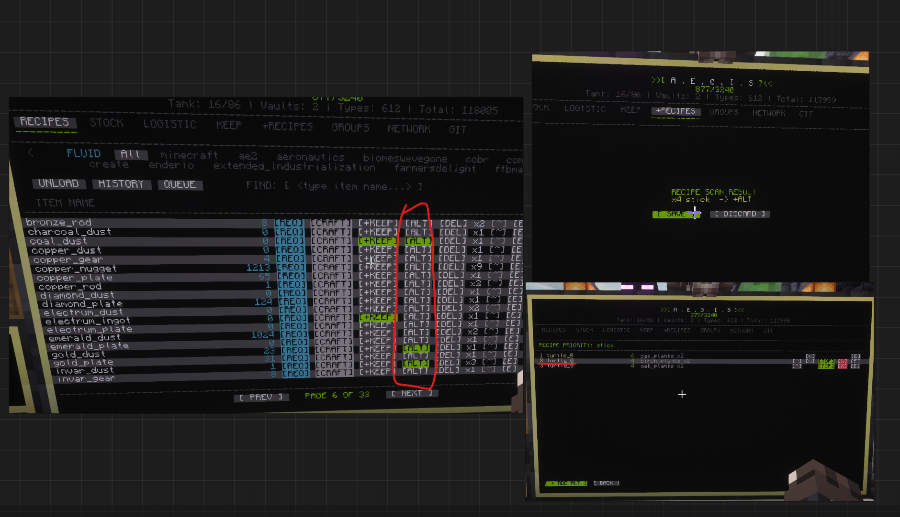</td>
<td valign="top" style="border:0;background:transparent;"><b>Alternatives (+ALT)</b>  If an item already has a recipe, you can add another one as <code>+ALT</code>. At craft time the alts are checked top to bottom, first one that matches the stock is picked.</td>
</tr>
<tr style="background:transparent;">
<td valign="top" width="42%" style="border:0;background:transparent;">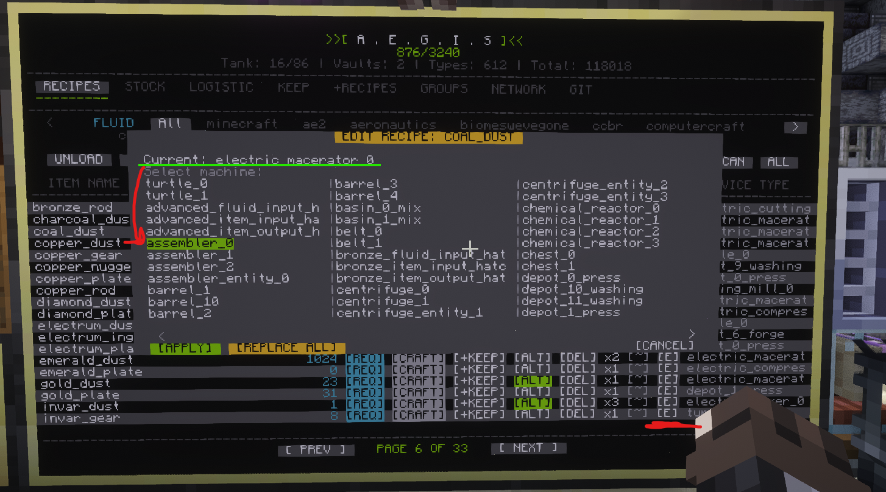</td>
<td valign="top" style="border:0;background:transparent;"><b>Editing</b>  <code>[E]</code> in the recipes tab lets you swap the machine for a recipe, or reassign a whole machine tag across every saved recipe at once.</td>
</tr>
</table>

---

## Autocrafting

<table border="0" cellspacing="0" cellpadding="8" style="border-collapse:collapse;border:0;background:transparent;">
<tr style="background:transparent;">
<td valign="top" width="42%" style="border:0;background:transparent;">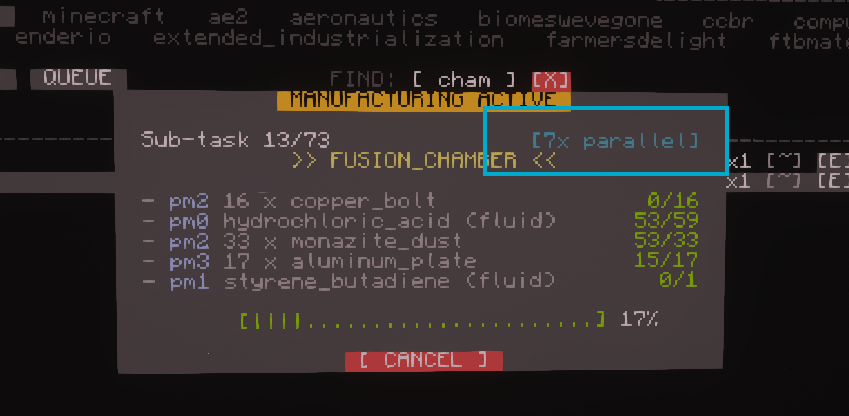</td>
<td valign="top" style="border:0;background:transparent;"><b>Parallel execution</b>  When you request an item, A.E.G.I.S. first looks at what's already in storage, then goes after the missing ingredients. Parts of the job that don't depend on each other can run at the same time if there are free machines. The header shows <code>parallel X</code> for active sub-tasks.</td>
</tr>
<tr style="background:transparent;">
<td valign="top" width="42%" style="border:0;background:transparent;">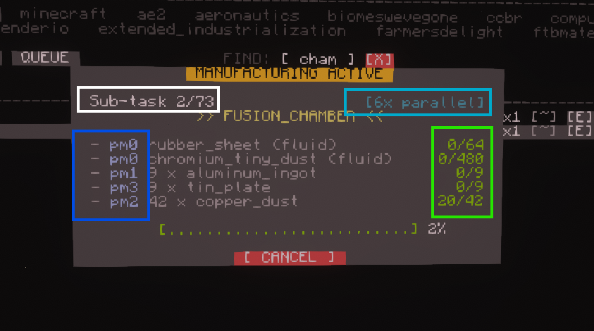</td>
<td valign="top" style="border:0;background:transparent;"><b>Multi-machine batching (<code>pm3</code>)</b>  For recipes with probabilistic outputs the system just keeps feeding ingredients until the requested count is reached. <code>pm3</code> on a task means 3 machines are working on it together.</td>
</tr>
<tr style="background:transparent;">
<td valign="top" width="42%" style="border:0;background:transparent;">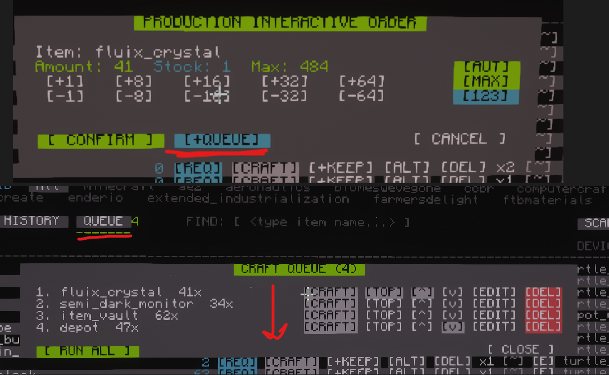</td>
<td valign="top" style="border:0;background:transparent;"><b>Queue</b>  You can queue several crafts at once. If one runs out of resources it gets a warning, stays in the queue, and the next order starts.</td>
</tr>
<tr style="background:transparent;">
<td valign="top" width="42%" style="border:0;background:transparent;">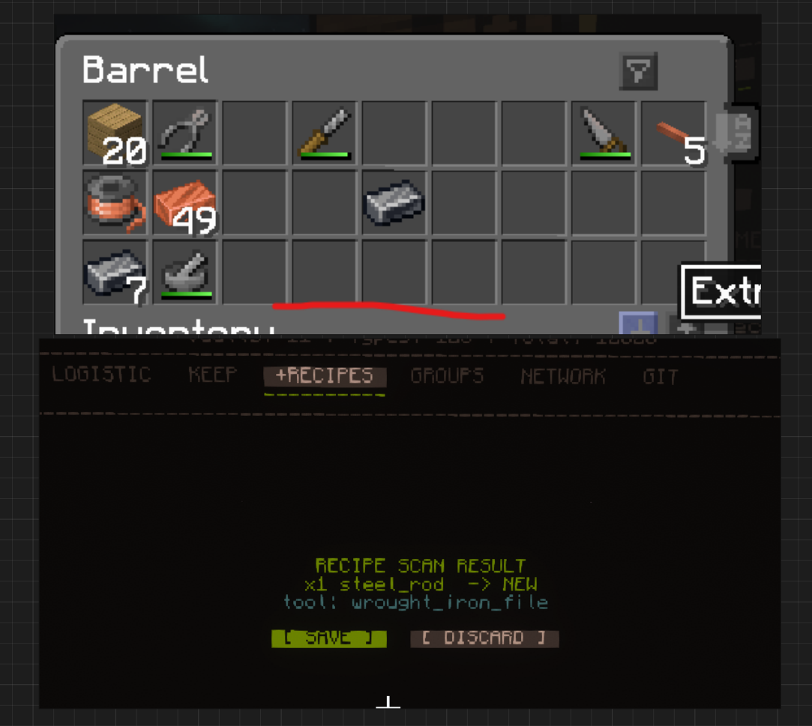</td>
<td valign="top" style="border:0;background:transparent;"><b>Tools</b>  GT-style durability tools (saws, hammers, files) are supported. If a tool breaks mid-craft, A.E.G.I.S. crafts a replacement first, then resumes the parent job.</td>
</tr>
<tr style="background:transparent;">
<td valign="top" width="42%" style="border:0;background:transparent;">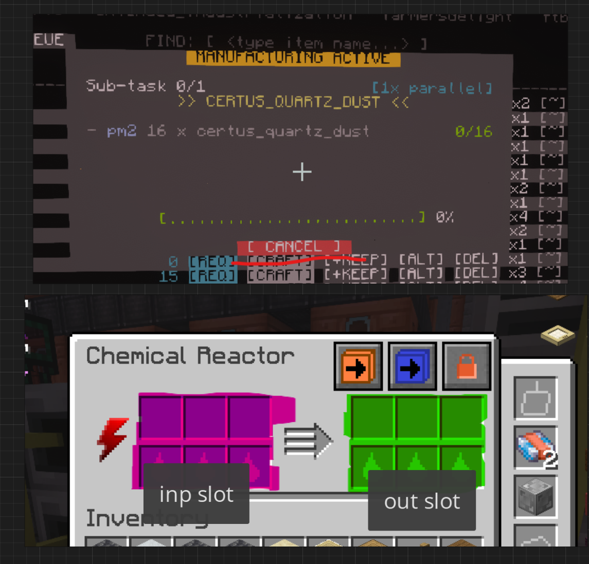</td>
<td valign="top" style="border:0;background:transparent;"><b>Cancel / cleanup</b>  Output slots are cleared before a sub-task and again on finish. Pressing <code>CANCEL</code> stops the current craft and dumps output slots to vaults. It can't always pull from input slots though — some mods block that (see limitations).</td>
</tr>
</table>

---

## Machines and groups

<table border="0" cellspacing="0" cellpadding="8" style="border-collapse:collapse;border:0;background:transparent;">
<tr style="background:transparent;">
<td valign="top" width="42%" style="border:0;background:transparent;">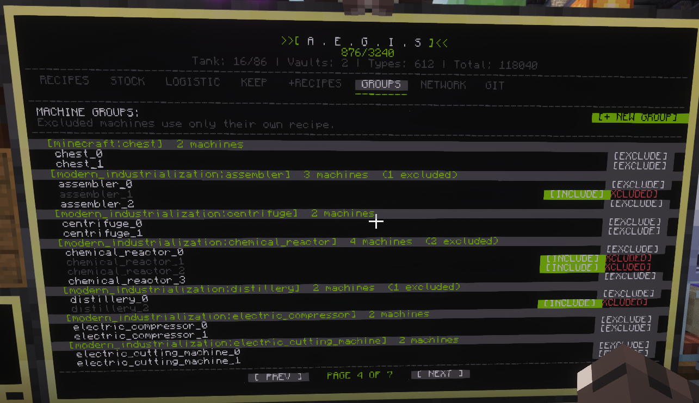</td>
<td valign="top" style="border:0;background:transparent;"><b>Auto-grouping</b>  Machines that share a peripheral name auto-form a pool, so you don't have to configure anything for the usual case.</td>
</tr>
<tr style="background:transparent;">
<td valign="top" width="42%" style="border:0;background:transparent;">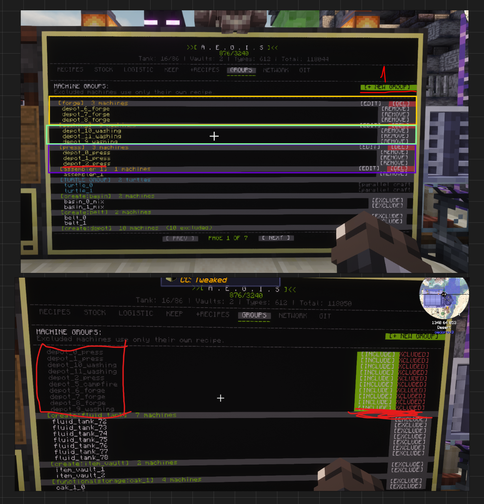</td>
<td valign="top" style="border:0;background:transparent;"><b>Custom groups</b>  You can also group machines manually — e.g. split Create Depots into <code>Depot Forge</code> vs <code>Depot Press</code>. If you add a machine to a custom group, exclude it from auto-grouping, otherwise it ends up in both.</td>
</tr>
<tr style="background:transparent;">
<td valign="top" width="42%" style="border:0;background:transparent;">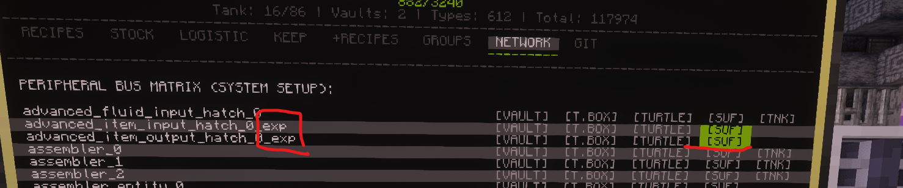</td>
<td valign="top" style="border:0;background:transparent;"><b>Exclusions & suffixes</b>  Individual machines can be excluded from a pool, or given a display suffix (<code>SUF</code>) in the NETWORK tab without breaking pooling.</td>
</tr>
<tr style="background:transparent;">
<td valign="top" width="42%" style="border:0;background:transparent;">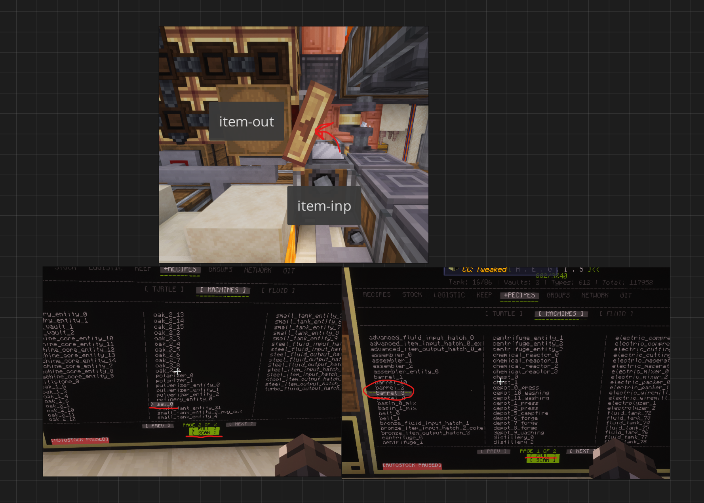</td>
<td valign="top" style="border:0;background:transparent;"><b>Multiblocks</b>  Multiblocks with separate input and output hatches are supported.</td>
</tr>
</table>

---

## Fluids

<table border="0" cellspacing="0" cellpadding="8" style="border-collapse:collapse;border:0;background:transparent;">
<tr style="background:transparent;">
<td valign="top" width="42%" style="border:0;background:transparent;">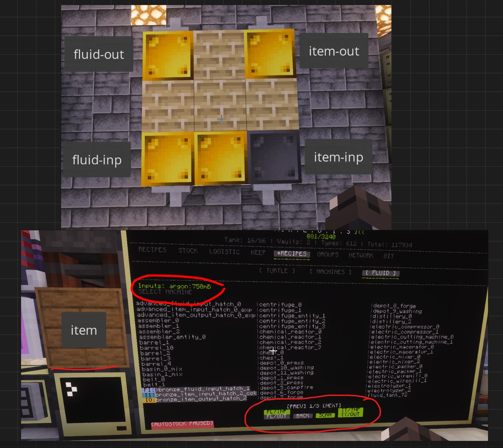</td>
<td valign="top" style="border:0;background:transparent;"><b>Hybrid & sequential pouring</b>  Solid+fluid recipes work, mB is tracked, and multiple fluids can be poured in sequence. For machines with more than one fluid hatch, route the fluids through transfer tanks with hatches attached.</td>
</tr>
<tr style="background:transparent;">
<td valign="top" width="42%" style="border:0;background:transparent;">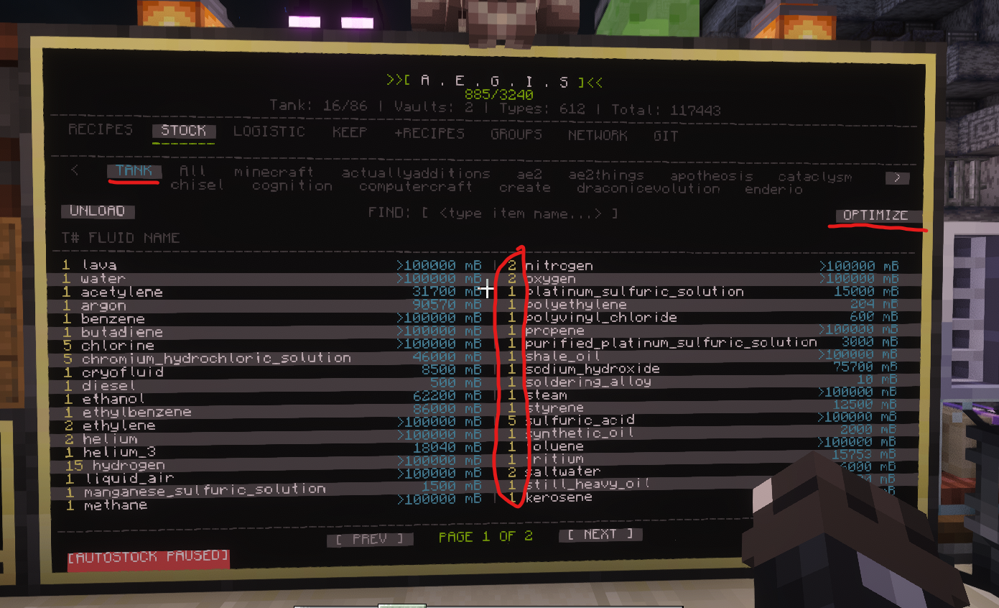</td>
<td valign="top" style="border:0;background:transparent;"><b>Fluid stock & OPTIMIZE</b>  The stock view shows how much of each fluid is in which tank. <code>OPTIMIZE</code> scans, merges and defrags fluid storage.</td>
</tr>
<tr style="background:transparent;">
<td valign="top" width="42%" style="border:0;background:transparent;">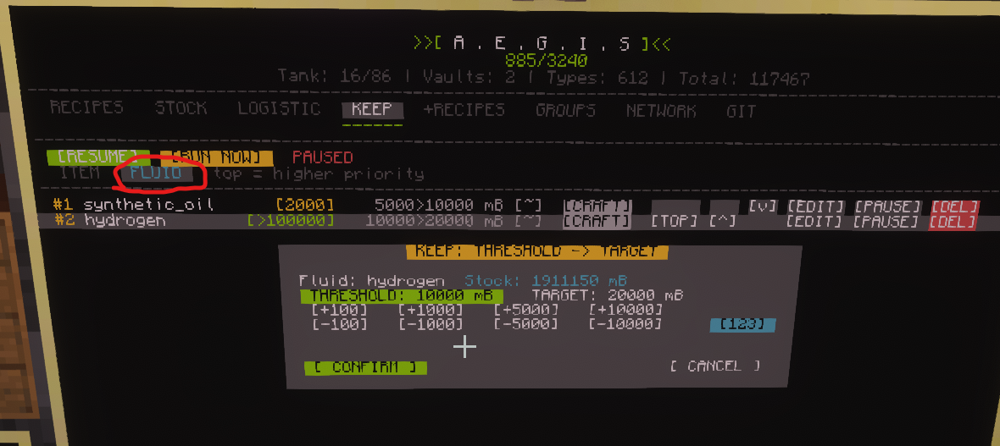</td>
<td valign="top" style="border:0;background:transparent;"><b>KEEP-FLUID</b>  <code>KEEP-FLUID</code> sets an automated mB buffer for a fluid, similar to KEEP for items.</td>
</tr>
</table>

---

## KEEP (auto-stocking)

<table border="0" cellspacing="0" cellpadding="8" style="border-collapse:collapse;border:0;background:transparent;">
<tr style="background:transparent;">
<td valign="top" width="42%" style="border:0;background:transparent;">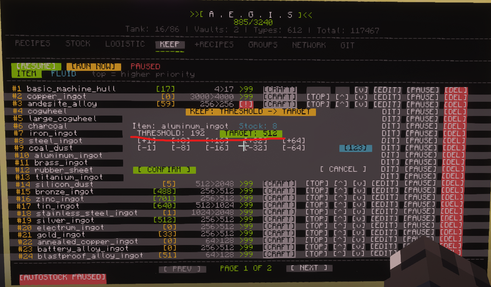</td>
<td valign="top" style="border:0;background:transparent;"><b>Threshold → target</b>  KEEP uses two numbers per item: a threshold and a target. Crafting starts only when stock drops below the threshold and stops once it reaches the target. So the system doesn't re-trigger a craft after every single item consumed.</td>
</tr>
<tr style="background:transparent;">
<td valign="top" width="42%" style="border:0;background:transparent;">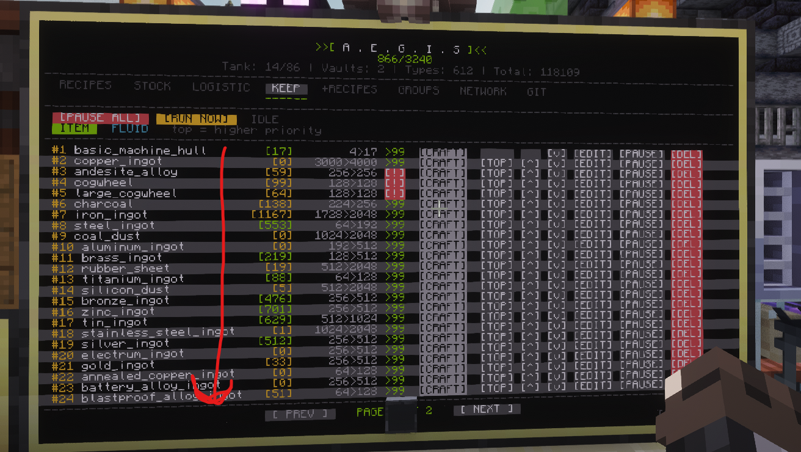</td>
<td valign="top" style="border:0;background:transparent;"><b>Priority order</b>  KEEP entries run in the order you set them — higher entries first.</td>
</tr>
<tr style="background:transparent;">
<td valign="top" width="42%" style="border:0;background:transparent;">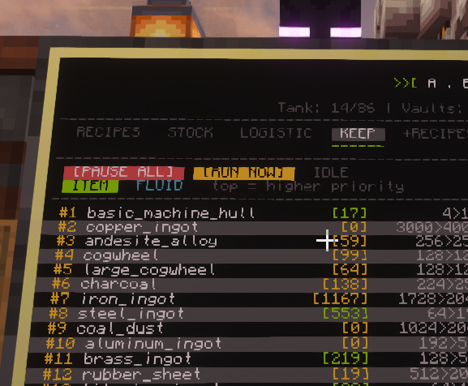</td>
<td valign="top" style="border:0;background:transparent;"><b>Idle execution</b>  KEEP runs automatically when the system has been idle for ~3 minutes and no manual craft is active. Can be paused at any time.</td>
</tr>
</table>

---

## Storage

<table border="0" cellspacing="0" cellpadding="8" style="border-collapse:collapse;border:0;background:transparent;">
<tr style="background:transparent;">
<td valign="top" width="42%" style="border:0;background:transparent;">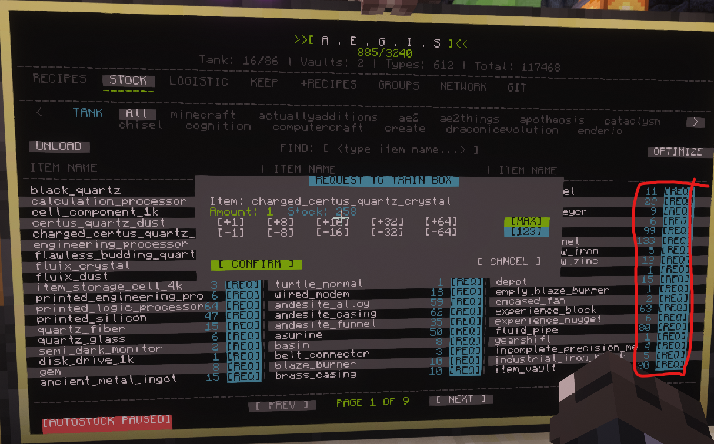</td>
<td valign="top" style="border:0;background:transparent;"><b>STOCK & request</b>  <code>STOCK</code> gives one unified view of everything in the connected vaults. From there you can request items straight into free T.BOX slots.</td>
</tr>
<tr style="background:transparent;">
<td valign="top" width="42%" style="border:0;background:transparent;">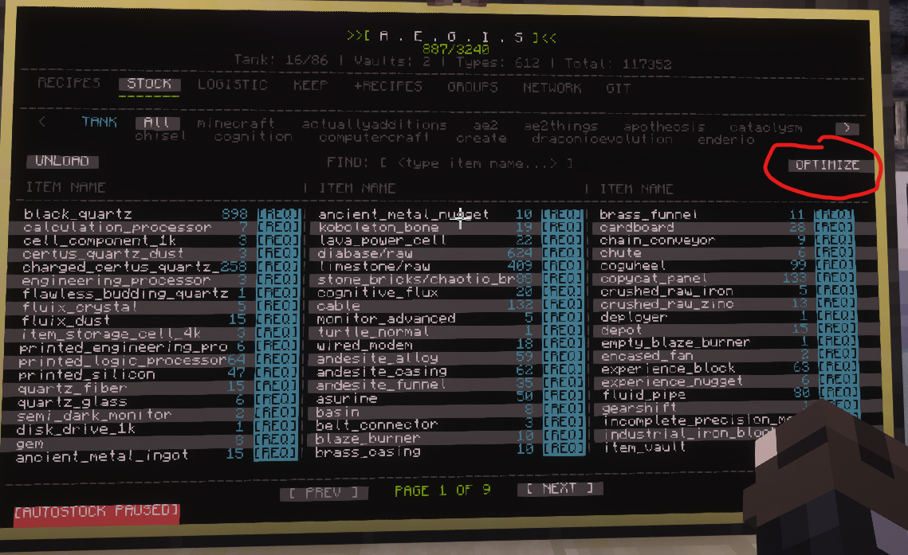</td>
<td valign="top" style="border:0;background:transparent;"><b>OPTIMIZE</b>  <code>OPTIMIZE</code> on the stock view walks every vault and merges unstacked stacks of the same item.</td>
</tr>
<tr style="background:transparent;">
<td valign="top" width="42%" style="border:0;background:transparent;">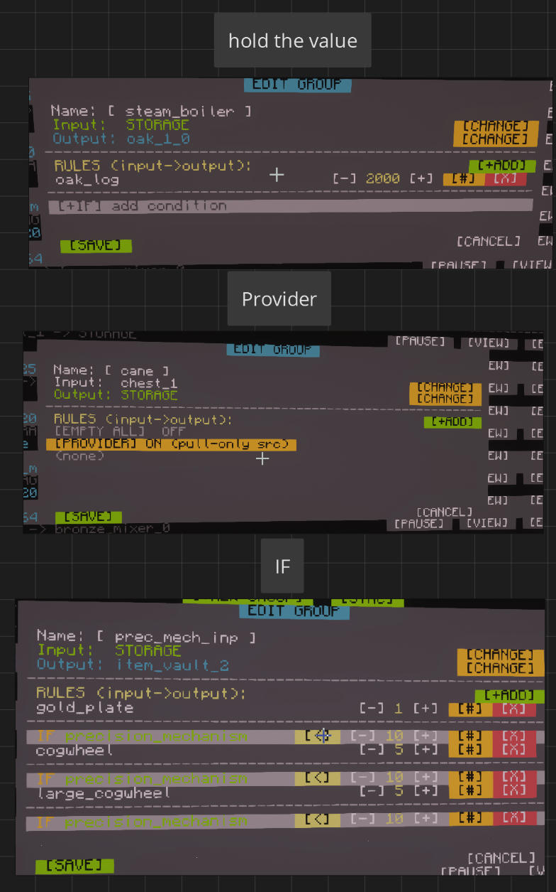</td>
<td valign="top" style="border:0;background:transparent;"><b>LOGICK transfer rules</b>  LOGICK replaces item/fluid pipes with rule-based transfers. Rules can be <code>Standard</code>, <code>Provider</code> (pull-only) or conditional <code>IF</code> like *move wood if charcoal < 32*.</td>
</tr>
</table>

---

## Remote and integrations

<table border="0" cellspacing="0" cellpadding="8" style="border-collapse:collapse;border:0;background:transparent;">
<tr style="background:transparent;">
<td valign="top" width="42%" style="border:0;background:transparent;">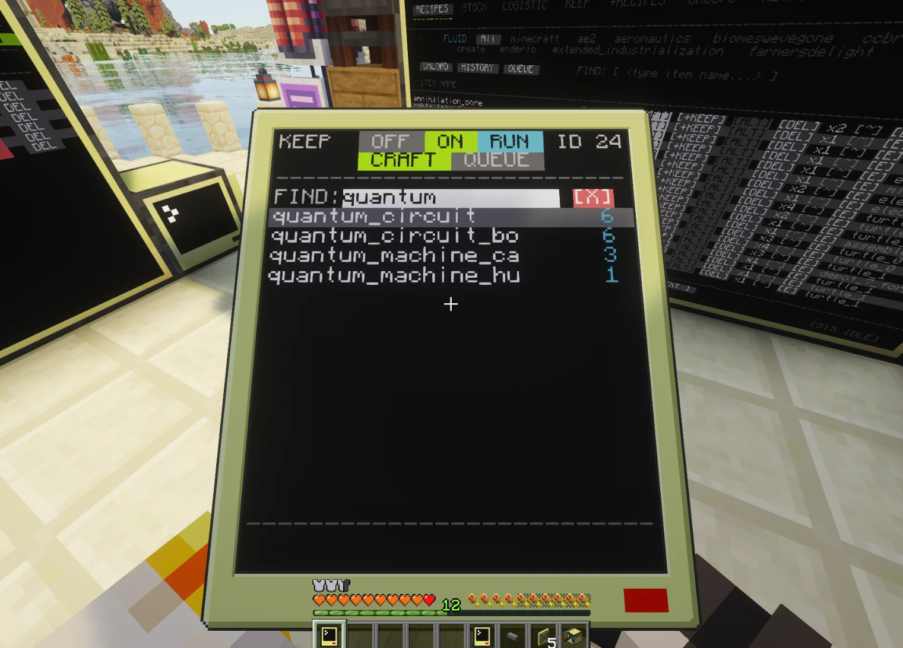</td>
<td valign="top" style="border:0;background:transparent;"><b>RedNet remote</b>  Run <code>remote_control</code> on a pocket computer with an Ender Modem to order items and follow live progress from anywhere in loaded chunks.</td>
</tr>
<tr style="background:transparent;">
<td valign="top" width="42%" style="border:0;background:transparent;">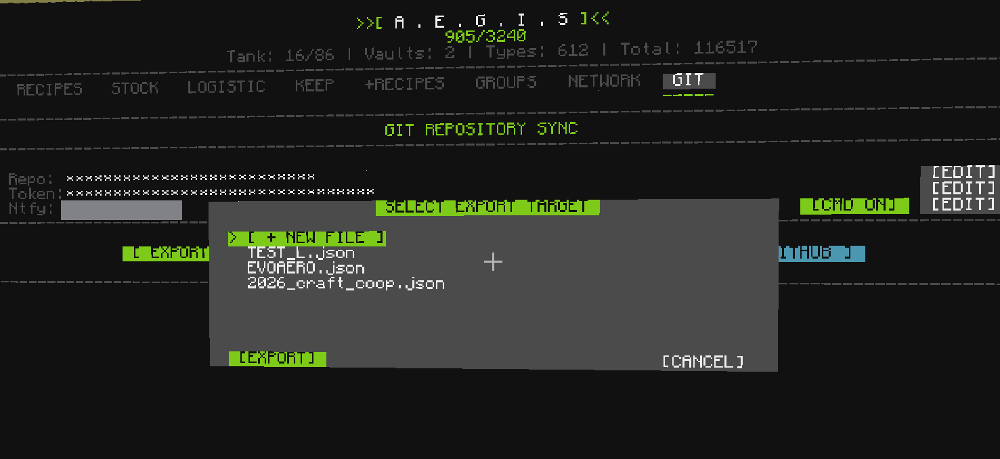</td>
<td valign="top" style="border:0;background:transparent;"><b>GitHub sync</b>  Recipe library can be exported/imported via a GitHub Personal Access Token. The token is masked in the UI and dropped from RAM on reboot.</td>
</tr>
<tr style="background:transparent;">
<td valign="top" width="42%" style="border:0;background:transparent;">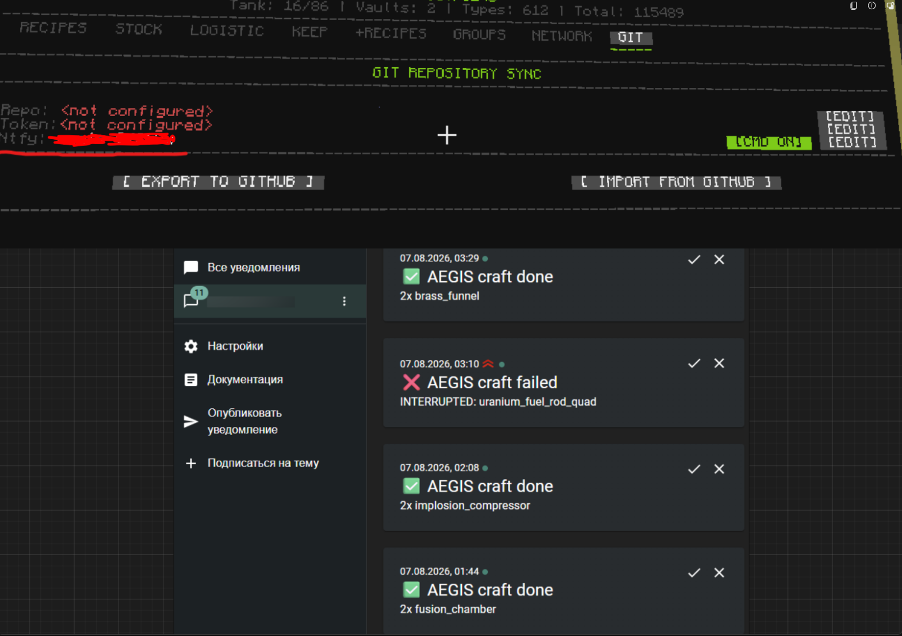</td>
<td valign="top" style="border:0;background:transparent;"><b>ntfy push</b>  Optional push notifications to your phone when a craft finishes.</td>
</tr>
</table>

---

## Known limitations

- Some mods don't expose machine input/output inventories through the CC:Tweaked peripheral API. For those you can usually put a chest between the machine and the network — [guide](https://www.reddit.com/r/ComputerCraft/comments/1uyx4td/comment/oy8femh/?utm_source=share&utm_medium=web3x&utm_name=web3xcss&utm_term=1&utm_content=share_button).
- Some mods let you push into an input slot but not pull out of it. `CANCEL` can't always recover items from those input slots — check them by hand after a cancel.
- Multiblocks may need transfer chests or separate input/output hatches, depending on how the mod wires them up.
- CC:Tweaked computers have a 1 MB filesystem cap. If new recipes stop saving or vanish on reboot, the computer folder is full — delete old `.BAK` files.
- Solid-fuel furnaces need a specific setup — [guide](https://www.reddit.com/r/ComputerCraft/comments/1uyx4td/comment/oyb7z51/?utm_source=share&utm_medium=web3x&utm_name=web3xcss&utm_term=1&utm_content=share_button).
- Machines must stay chunk-loaded for a job to keep running.
- The Advanced Computer must sit directly to the left of the monitor wall — the layout code assumes this.
- Keep an eye on free vault and tank space at the top of the monitor. If there's nowhere to unload, collection tasks stall.

  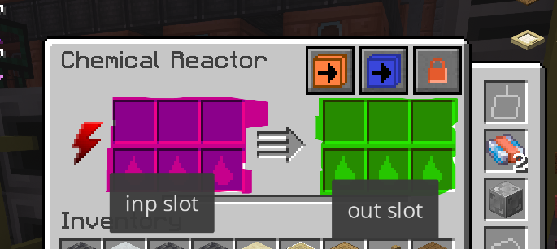
  &nbsp;&nbsp;
  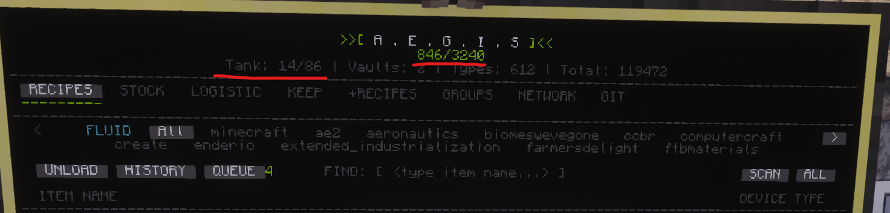

In practice, most machines from most mods should work with Modern Industrialization / Create / Greg_th / PneumaticCraft, etc. For some mods, such as Mekanism, which don't have integration with CC, you'll need workarounds — for example, chests for transferring items.

---

Community & support: https://www.reddit.com/r/ComputerCraft/comments/1uyx4td/aegis_autocraft_for_computercraft_cctweaked/

Setup & guide video: https://youtu.be/mhVkOqG2S1A?si=LeTGJ9jsijtcVPoM
